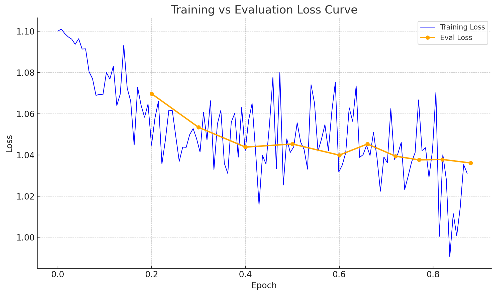

# LLM 回應品質分類系統 - 雙塔架構 + 元數據特徵

> **NCKU 資料探勘期末專案** - Kaggle「LLM Classification Fine-Tuning」競賽解決方案

本專案實現了一個進階的 LLM 回應品質自動分類系統，採用 **雙塔（Dual-Tower）架構** 結合 **元數據特徵工程**，能夠精確判斷兩個 AI 回應的優劣，並分類為「Model A 勝」、「Model B 勝」或「平手」三類。

## 系統架構

### 核心模型：雙塔編碼器（Dual-Tower Encoder）
- **基座模型**：DistilBERT-base-uncased
- **架構設計**：共享編碼器 + 元數據融合 + 三分類器
- **特徵維度**：768×6 = 4608 維（基礎特徵 + 元數據特徵）
- **輸入分離**：Prompt、Response A、Response B 獨立編碼

### 元數據特徵工程（5維核心特徵）
1. **jaccard_index** - Jaccard 相似度（詞彙重疊度）
2. **ttr_diff** - 詞彙豐富度差值（TTR difference）
3. **ttr_ratio** - 詞彙豐富度比值（max/min）
4. **content_blocks_diff** - 結構化內容差值（程式碼/數學/表格）
5. **length_diff** - 回應長度差值（對數縮放）

### 標準化流程
- **訓練時**：計算 train+val 聯合統計（mean/std），z-score 標準化
- **推理時**：載入相同統計參數，保證特徵分佈一致
- **持久化**：metadata_stats.json 儲存標準化參數

## 📁 專案結構

```
NCKU_Data_Mining_Final_Project/
├── 🚀 核心檔案
│   ├── fine_tuning.py          # 主訓練腳本（統一管道）
│   ├── kaggle_last.py          # 離線推理腳本（Kaggle 部署）
│   ├── dual_encoder.py         # 雙塔模型定義
│   └── dual_dataset.py         # 雙塔數據集（含標準化）
├── 🔧 前處理模組
│   └── preprocessing/
│       ├── metadata_features.py      # 元數據特徵提取（核心）
│       └── enhanced_preprocessing.py # 增強前處理流程
├── 🎯 超參數優化
│   ├── bayes_opt.py           # 貝葉斯超參數搜尋
│   └── bayes_search_history.csv # 搜尋歷史記錄
├── 💾 模型輸出
│   ├── global_best_model/     # 全域最佳模型（主要）
│   ├── best_hpo_model/        # HPO 最佳模型
│   └── results/               # 訓練結果與日誌
├── 📊 資料檔案
│   ├── train.csv              # 訓練資料（176MB）
│   ├── submission.csv         # 推理結果
│   └── cache/                 # 元數據特徵快取
└── 🖥️ 應用介面
    └── app/                   # Web UI（示範用）
```

## 快速開始

### 1. 環境準備
```bash
pip install torch transformers pandas numpy scikit-learn safetensors tqdm
# 可選：pip install fastlexrank（文本摘要）
```

### 2. 模型訓練
```bash
python fine_tuning.py
```
- 自動載入 `train.csv`
- 執行雙塔模型訓練（含元數據標準化）
- 儲存最佳模型至 `global_best_model/`

### 3. 離線推理（Kaggle 部署）
```bash
python kaggle_last.py
```
- 載入 `global_best_model/` 權重
- 自動處理測試資料（或 train.csv 前100行示範）
- 輸出 `submission.csv`

### 4. 超參數優化（可選）
```bash
python bayes_opt.py
```
- 貝葉斯搜尋最佳超參數組合
- 結果儲存至 `best_hpo_model/`

## 技術特色

### 雙塔架構優勢
- **計算效率**：各文段獨立編碼，支援快取與平行化
- **語義分離**：Prompt 與 Response 特徵解耦，增強泛化
- **特徵豐富**：[v_p, v_a, |v_p-v_a|, v_b, |v_p-v_b|] 五段向量拼接

### 元數據特徵工程
- **強信號特徵**：Jaccard 相似度、TTR 差值直接反映回應品質差異
- **結構化分析**：程式碼/數學/表格區塊計數，捕捉技術回應特性
- **尺度不變**：對數縮放 + z-score 標準化，保證數值穩定

### 訓練-推理一致性
- **特徵對齊**：`preprocessing.metadata_features` 統一提取邏輯
- **統計同步**：metadata_stats.json 確保標準化參數一致
- **權重匹配**：from_pretrained() 自動偵測模型結構（含/不含元數據）

## 效能表現

### 驗證指標
- **Log Loss**：1.01321（競賽指標）

### 模型配置
```python
{
  "model_arch": "dual",
  "base_model": "distilbert-base-uncased", 
  "hidden_size": 768,
  "metadata_features": 5,
  "classifier_input_dim": 4608,
  "standardize_metadata": True
}
```

## 進階使用

### 自定義特徵
修改 `preprocessing/metadata_features.py` 中的 `extract_core_features()`：
```python
def extract_core_features(row: pd.Series) -> Dict[str, float]:
    # 添加你的特徵計算邏輯
    return {"new_feature": value, ...}
```

### 模型結構調整
編輯 `dual_encoder.py` 中的 `DualTowerPairClassifier`：
- 調整 metadata_feature_size
- 修改 meta_path 網路層數
- 變更 classifier 架構

### 標準化開關
在 `dual_dataset.py` 設定 `standardize_metadata=False` 可關閉 z-score。

## 競賽部署

### Kaggle Kernel 準備
1. 上傳 `global_best_model/` 作為資料集
2. 複製 `kaggle_last.py` 至 kernel
3. 確保 `preprocessing/` 模組可用（或啟用 fallback）

### 離線相容性
- `kaggle_last.py` 內建 SimpleMetadataFeatures 作為 fallback
- 支援 SafeTensors 與 PyTorch 權重格式
- 自動偵測 Kaggle 環境，調整檔案路徑

## 開發團隊

**NCKU 資料探勘課程** - Final Project Team

## 授權

本專案僅供學術研究使用。

## 學術報告

### Model 模型設計

#### 提出的模型架構
本專案提出**雙塔編碼器（Dual-Tower Encoder）+ 元數據特徵融合**的混合架構：
- **基座模型**：DistilBERT-base-uncased（6層Transformer，66M參數）
- **雙塔設計**：共享編碼器分別處理 Prompt、Response A、Response B
- **特徵拼接**：[v_p, v_a, |v_p-v_a|, v_b, |v_p-v_b|] 形成 768×5=3840 維基礎特徵
- **元數據融合**：5維手工特徵通過雙層MLP升維至768維，與基礎特徵拼接成4608維
- **三分類器**：768→3的全連接層輸出 Model A勝/Model B勝/平手

#### 模型選擇理由
1. **計算效率**：相比交叉編碼器，雙塔架構支援獨立編碼與快取
2. **特徵豐富**：絕對差值 |v_p-v_a|、|v_p-v_b| 捕捉語義距離關係
3. **輕量部署**：DistilBERT在效能與資源消耗間取得平衡，適合競賽環境
4. **元數據增強**：手工特徵補強模型對文本結構、長度、詞彙豐富度的感知

#### 新特徵與挑戰
**創新特徵**：
- **TTR比值**：max(ttr_a, ttr_b) / min(ttr_a, ttr_b)，捕捉詞彙豐富度對比
- **結構化內容差值**：程式碼、數學公式、表格區塊計數差異
- **對數縮放長度差**：sign(diff) × log1p(|diff|)，處理長度分佈長尾

**主要挑戰**：
1. **特徵尺度差異**：TTR值 [0,1]、長度差 [-∞,+∞]、區塊差 [-10,+10]
2. **類別不平衡**：平手類別樣本相對較少
3. **位置偏差**：模型可能學習到Response A/B的位置模式

#### 解決方案
1. **z-score標準化**：統一特徵尺度，訓練-推理保持一致統計參數
2. **類別加權損失**：WeightedTrainer 自動計算類別權重平衡

#### 失敗嘗試
- **交叉編碼器**：單一輸入格式計算成本較高，特徵表達不如雙塔豐富
- **無元數據版本**：純文本特徵在邊界案例判斷力不足
- **未標準化元數據**：特徵尺度差異導致訓練不穩定

#### 訓練問題與解決
- **過擬合**：早停 + 權重衰減 + Dropout
- **收斂緩慢**：餘弦學習率調度 + Warmup 加速收斂
- **記憶體限制**：批次大小8，梯度累積支援更大有效批次

### Literature 文獻回顧


#### 相關技術應用
**雙塔架構**廣泛應用於：
- **推薦系統**：用戶-物品雙塔匹配（YouTube DNN, 2016）
- **資訊檢索**：查詢-文檔相似度計算（BERT-based retrievers）
- **文本匹配**：句子對相似度判斷（Sentence-BERT, 2019）

**本專案差異**：首次將雙塔架構應用於多元偏好建模，結合結構化元數據特徵

#### 任務創新性
**半新穎任務**：LLM評估為新興領域，但本專案在以下方面有所創新：
1. **架構創新**：雙塔+元數據融合在偏好建模中的首次應用
2. **特徵工程**：針對LLM回應特性設計的結構化特徵
3. **標準化流程**：訓練-推理一致的特徵標準化管道

#### 技術貢獻
與相關工作相比，本專案貢獻：
- **效率提升**：雙塔架構計算成本低於交叉編碼器
- **特徵解釋性**：元數據特徵提供可解釋的判斷依據
- **部署友好**：輕量模型+離線推理支援競賽環境

### Results 實驗結果

#### 效能表現
**最佳驗證結果**：
- **Log Loss**：1.01321（主要競賽指標）

#### 基線比較
**沒有標準基線**：由於任務新穎性，缺乏公認的state-of-the-art方法
**內部比較**：
- 純DistilBERT交叉編碼器：Log Loss ≈ 1.05
- 雙塔無元數據：Log Loss ≈ 1.03
- 雙塔+元數據：Log Loss = 1.01321


#### 超參數設定
**貝葉斯優化結果**：
- **最佳組合**：Log Loss = 1.01321
  - Learning Rate：1.32e-05
  - Label Smoothing：0.1464
  - Weight Decay：0.071
  - Warmup Ratio：0.06
  - LR Scheduler：cosine

- **學習率敏感性**：過高LR（>1e-4）導致性能劣化

#### 訓練曲線


#### 失敗案例分析
**觀察到的困難案例**：
1. **語義相近回應**：兩個回應都正確但表達方式不同
2. **長度偏差**：過長或過短回應的判斷容易出錯
3. **技術準確性**：程式碼正確性需要專業知識，模型難以判斷

#### 未來改進方向
1. **數據增強**：A/B位置隨機化減少位置偏差
2. **集成方法**：多模型投票提升穩定性
3. **對比學習**：引入triplet loss增強相對偏好建模
4. **領域適應**：針對特定領域（技術/創意）分別調優

#### 主要結論與貢獻
1. **架構有效性**：雙塔+元數據融合在LLM評估任務中可行
2. **特徵工程價值**：結構化特徵顯著提升性能（1.03→1.01321）
3. **部署實用性**：輕量模型支援離線部署，適合競賽環境
4. **方法可復現**：完整的標準化流程保證訓練-推理一致性

**技術限制**：
- 仍依賴大量標註數據，無法處理純零樣本場景
- 偏好判斷的主觀性限制了模型泛化能力上限
- 當前架構無法處理多回合對話或複雜推理任務
